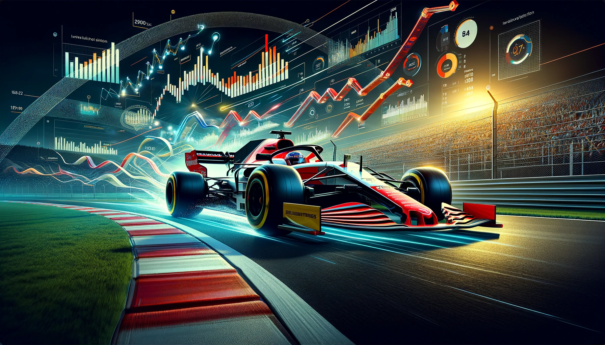

# Project of Data Visualization (COM-480)

<!-- PROJECT LOGO -->
 

  

| Student's name | SCIPER |
| -------------- | ------ |
| Colin Pelletier | 336438 |
| Yahya Hadi | 302907 |
| Xavier Ogay | 301681 |

[Milestone 1](#milestone-1) • [Milestone 2](#milestone-2) • [Milestone 3](#milestone-3)

[Website](https://com-480-data-visualization.github.io/pitstop-plotters/)

## Milestone 1

**10% of the final grade**

This is a preliminary milestone to let you set up goals for your final project and assess the feasibility of your ideas.

### Dataset

> Find a dataset (or multiple) that you will explore. Assess the quality of the data it contains and how much preprocessing / data-cleaning it will require before tackling visualization. We recommend using a standard dataset as this course is not about scraping nor data processing.
>
We would like to create interactive visualizations from the [Formula 1 World Championship (1950-2023)](https://www.kaggle.com/datasets/rohanrao/formula-1-world-championship-1950-2020) dataset from Kaggle. This dataset contains data from the Formula 1 World Championship from the 1950 season to the last completed season in 2023.
It has a high usability score of **10** on Kaggle and is the most complete dataset we've found on the topic. It contains a lot of interesting information stored in different tables about:
- Tracks 
- Drivers 
- Constructors 
- Championship standings
- Race results 
- Qualifying results 
- Lap times 
- Pit stops

All tables contain primary keys and foreign keys, which allows us to get the necessary information by only doing merges between the tables (easily done with the Pandas Python library).

Additionally, this dataset has been studied by many people who have published their Jupyter notebooks on Kaggle. Most of those notebooks focus on preprocessing and simple non-interactive visualizations. Using them will allow us to spend less time on pre-processing and data cleaning and focus our work on visualizations. Here's an example of a very complete notebook that we have already successfully run locally: [Jupyter notebook example](https://www.kaggle.com/code/akhilreddy9554/formula-1-a-visual-explorative-analysis).

Our preprocessing tasks will mostly consist of merging tables to extract some missing statistics.
Also some work is required to deal with the ``“\N”`` values which correspond to races not finished. Eg: in the races.position column.

### Problematic

> Frame the general topic of your visualization and the main axis that you want to develop.
> - What am I trying to show with my visualization?
> - Think of an overview for the project, your motivation, and the target audience.

Formula 1 is an extremely interesting sport that has seen a increase in interest in recent years due to its excellent social media management and the Netflix series [Formula 1: Drive to Survive](https://en.wikipedia.org/wiki/Formula_1:_Drive_to_Survive). This allowed new fans to catch up on the past few seasons without delving too deep into the subject. However, it might become difficult to get information and statistics about Formula 1 in an interactive and entertaining way when trying to strengthen one’s knowledge.

 In our project we want to bring more information to people who are new to this sport. The goal will be to first provide them with the most important information about the F1 race sport, such as **the most successful and experienced drivers and teams**, and **the standings of the different seasons**. In the second part, we will present the internationality of the sport and where the focus is according to the different decades, potentially with a **world map showing the circuits**, with statistics like their altitude, best lap time and the driver who performed it, the team with most wins there, and **the drivers and their stats from the different countries**. Finally, to give our users an idea of the evolution of this engineered-focus competition, we would like to  present some technical aspects such as the evolution of lap times and pit stop times.

The goal of this project is to keep the content as readable, simple and entertaining as possible so that readers don't need to have any previous knowledge of the sport to read it, but will gain interest in the sport and potentially become motivated to dig further into the subject.

(<a href="#readme-top">back to top</a>)

### Exploratory Data Analysis

> Pre-processing of the data set you chose
> - Show some basic statistics and get insights about the data

#### Historical Success:

##### Top 10 teams with the most wins of all time:

##### Top 10 drivers with the most wins of all time:

#### Geographical Analysis:

##### Countries with the most champions:

##### Driver nationalities distribution:

#### Circuits Analysis:

(<a href="#readme-top">back to top</a>)

### Related work

> - What others have already done with the data?
> - Why is your approach original?
> - What source of inspiration do you take? Visualizations that you found on other websites or magazines (might be unrelated to your data).
> - In case you are using a dataset that you have already explored in another context (ML or ADA course, semester project...), you are required to share the report of that work to outline the differences with the submission for this class.
 
 Most websites introducing Formula 1 are either text-heavy, not interactive, or overly complicated, even though they are interesting. Our goal is to focus on simplicity and interaction to provide essential information. Among our sources of inspiration, we found:

- This Business Insider article about the survey [Who's the greatest F1 driver](https://www.businessinsider.com/who-is-the-greatest-formula-1-driver-of-all-time). The sliding story and different images make it interesting to read, with easy-to-understand plots.

- This great [dashboard](https://jasonjpaul.squarespace.com/formula-1-data-vis):, which aims to summarize the facts of F1 history. It provides interesting statistics (best drivers at the bottom, history facts at the top right) and is well designed. However, as a beginner, it might seem scary to deal with such a beast.

- [Jupyter notebooks](https://www.kaggle.com/datasets/rohanrao/formula-1-world-championship-1950-2020/code?datasetId=468218) related to the Kaggle dataset . While these provide interesting insights, their audience and interaction possibility is limited by the technicality of their platform.

- Quirky and funny visualization of world leaders, which makes the introduction less formal and more appealing: [here](https://www.visualcapitalist.com/visualized-world-leaders-in-positions-of-power/).

(<a href="#readme-top">back to top</a>)

## Milestone 2

**10% of the final grade**

The Milestone 2 document is available on [./docs/Milestone-2.pdf](./docs/Milestone-2.pdf).
The website in a skeleton state is available [here](https://com-480-data-visualization.github.io/pitstop-plotters/).

### Tools and Related Lectures

The website is based on React, and the visualizations are made in D3.js.

| Visualization              | Tools                           | Related Lectures                                   |
|----------------------------|---------------------------------|----------------------------------------------------|
| Global Leaderboard         | d3, d3-color, d3-timer          | do’s and don’ts, interaction, d3.js                |
| Hall of Fame               | d3, d3-color                    | do’s and don’ts, interaction, d3.js                |
| Circuits World Map         | d3, d3.geo, topojson            | Maps, practical maps, perception and color, interaction, more interactions, d3.js |
| Season battles             | d3                              | do’s and don’ts, d3.js                             |
| Drivers and teams associations | d3, d3-force, d3-color        | Graphs, do’s and don’ts, d3.js                     |

### Project Goals

The goal of this project is to provide an insightful introduction to the world of Formula 1. We want to provide a global overview of the sport by highlighting the main facts in an interactive way, which will hopefully encourage new fans to dig further into this interesting sport. To do so, we want to create a linear website so that the user follows the story as we intended it. He will of course be free to come back to the previous visualizations when he wants.

### Minimum Viable Product

#### 0. The main page
A small textual presentation of Formula 1 and what we will investigate on this website.

#### 1. Global leaderboard
A dynamic leaderboard showing the drivers and the teams with the largest number of victories each year since the beginning of Formula 1.

#### 2. Hall of Fame (top 5 pilots of all time)
An interactive panel exploring the top 5 most successful drivers of all time.

#### 3. Circuit World map
A dynamic panel containing a 2D world map with circuit locations.

#### 4. Season points
A dynamic graph for inspecting interesting battles in different seasons.

#### 5. Drivers and teams associations
A disjoint force-directed graph showing the relationships between drivers and teams.

_Note: A color will be assigned to each team participating in the 2024 driver championship for uniformity._

### Implementation Strategy

1. Find additional necessary data for Hall of Fame (all available on Wikipedia).
2. Export data.
3. Implement each visualization.
4. Adapt the website and add visualizations.
5. Map data to visualizations.
6. Write the story text and add it to the website.

### Extra Ideas

- **Global leaderboard**: Include a button to visualize different stats.
- **Season points**: Display telemetry information when a user clicks on a race.
- **Drivers and teams associations**: Use different sizes for points to highlight importance.
- **Strategy breakdown** (optional new graph): A detailed analysis of race strategies.

## Ilustrations
### Minimal Viable Product

### Mock-up example for the theme

(<a href="#readme-top">back to top</a>)

## Milestone 3

**80% of the final grade**

[product-screenshot]: img/ilustr.webp

(<a href="#readme-top">back to top</a>)

